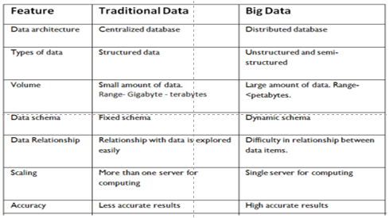

# INTRODUCTION
A collection of data that is huge in volume and yet growing exponentially with time. 

Examples
- New York Stock Exchange : one terabyte of new trade data per day
- Social Media
- Jet Engine

---

---

### Characteristics Of Big Data(5 V’s)

Back in 2001, Gartner analyst **Doug Laney** listed the 3 ‘V’s of Big Data –  
Variety, Velocity, and Volume

1. VOLUME
2. VELOCITY
3. VARIETY
4. VARACITY
5. VALUE
