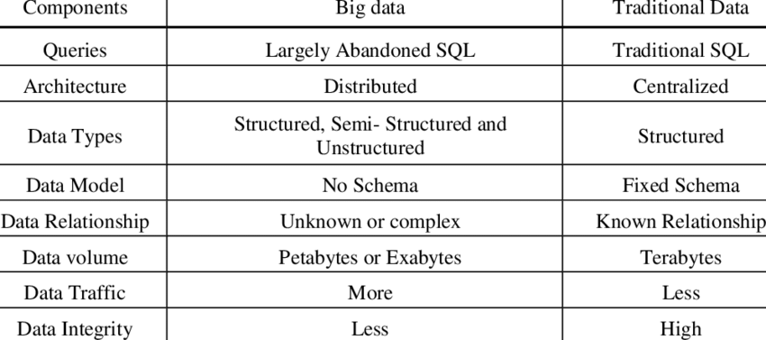
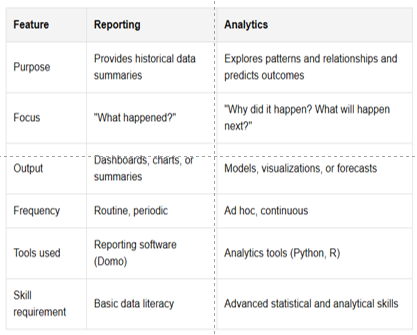

# Big Data 
Extremely large, complex, and rapidly growing datasets that traditional data-processing systems cannot handle  
Back in 2001, Gartner analyst **Doug Laney** listed the 3 ‘V’s : Variety, Velocity, and Volume
- Volume – huge amounts of data (TBs, PBs).
- Velocity – data generated at high speed (real-time streams).
- Variety – structured, semi-structured, and unstructured data.
- Veracity – uncertainty, inconsistency, and quality issues.
- Value – hidden business insights extracted from data.

Big Data enables organisations to uncover patterns, trends, and insights that improve decision-making, automation, and innovation.  

New York Stock Exchange : one terabyte of new trade data per day

Key Components
- Distributed Storage (HDFS, NoSQL, Object Storage)
- Distributed Processing (Hadoop MapReduce, Spark)
- Workflow & Resource Management (YARN, Mesos)
- Query Engines (Hive, Impala, Presto)
- Data Integration Tools (Sqoop, Flume, Kafka)
- Analytic Tools (R, Python, Power BI, Tableau)

Traditional RDBMS-based systems fail with Big Data due to:

1. Limited Scalability 
2. Performance Bottlenecks
3. Schema Rigidity
4. Storage Limitations
5. High Cost
6. Inability to Handle Variety

---

---

# ANALYTICS

### IDA ?
Method to uncover the hidden designs in large data,  
to extract useful information 

---
Analytic Processes -
1. Data Collection
2. Data Cleaning & Pre-processing
3. Data Integration
4. Data Storage (Data Lakes, Warehouses)
5. Data Exploration (EDA)
6. Model Building (ML, Statistics)
7. Evaluation
8. Deployment & Monitoring
---

TOP ANALYTICS TOOLS
1. Hadoop Ecosystem: MapReduce, Hive, Pig, HBase
2. Apache Spark: MLlib, Streaming
3. Data Visualization: Tableau, Power BI
4. Programming: Python, R, Scala
5. Cloud Platforms: AWS EMR, GCP BigQuery, Azure Synapse

---
# Statistical Concepts
1. Sampling Distributions
2. Resampling
3. Statistical Inference
4. Prediction Error