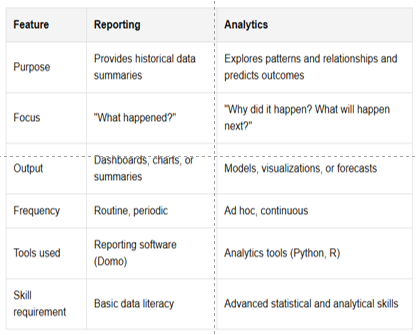

# ANALYTICS
Big data analytics is a method to uncover the hidden designs in large data, to extract useful information 

---
STAGES OF IDA -
1. Preparation Of DATA  
Selecting/Gathering data from relevant sources
2. Data Mining  
Discovering insights from data
3. Data Validation & Explanation

---
CLASSIFICATION
1. Descriptive
2. Predictive
3. Perspective
4. Diagnostic

---
TOP ANALYTICS TOOLS
1. R Language
2. **Apache Spark**  
Open Source, 80 operators to build parallel apps, run hadoop cluster, 100 time faster in memory and 10 time in disk
3. **IBM SPSS**  
Predictive Platform 
4. **MongoDB**  
written in c, c++, js, open sources, uses BSON
5. **Ploty**  
Online tool, lets user create charts & dashboards

---
