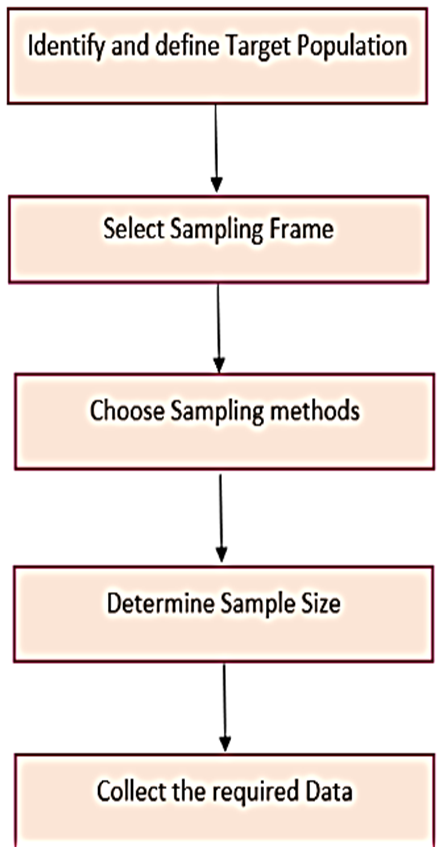

SAMPLING ?   
Statistical method that selects a representative subset (sample) from a large dataset  
Retain all the significant characteristics and behavior of the stream 

---
TYPES 
1. **Probability Sampling** involves random selection, each item of population has equal chance of being selected.
   1. Simple random sampling
   2. Systematic : Sorting + item chosen at intervals
   3. Startified : Dividing in subgroups
   4. Cluster : Mutual exclusive subgrps, entire group chosen

2. **Non Probability Sampling** involves non-random selection based on convenience or other criteria, Items do not have equal chance of being selected
   1. Convenience
   2. Voluntary Response
   3. Purposive : Judgement
   4. Snowball : recruit participants via other participants

---

Re-Sampling

Definition:  
Drawing repeated samples from observed data to assess variability.

Techniques:
1. Bootstrapping: Random sampling with replacement.
2. Cross-validation: Assessing model performance on different subsets.

---
3.3 Statistical Inference

Definition:  
Process of using sample data to make conclusions about a population.

Types:
1. Estimation: Estimating population parameters (mean, proportion).
2. Hypothesis Testing: Testing assumptions about population parameters.

Example: Testing if a new algorithm improves prediction accuracy compared to the old one.

---
3.4 Prediction Error

Definition: Difference between predicted and actual values.

Types:

1. Bias: Error due to oversimplification.
2. Variance: Error due to sensitivity to small data fluctuations.
3.  Error: Noise inherent in data.

Importance: Minimizing prediction error improves model accuracy in data analytics.