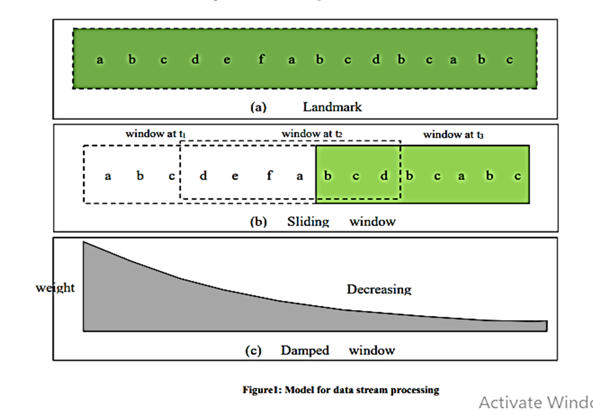

1. LANDMARK MODEL  
This model finds the frequently used items in entire data stream from specific time till present  
For eg: Stock monitor system

2. SLIDING WINDOW MODEL  
This model stores recent data in sliding window from a certain range and discard old data items

3. DAMPED MODEL  
This model is also called as Time-Fading model as it assigns more weight to the recent transactions in data stream and this weight keeps on decreasing with age

