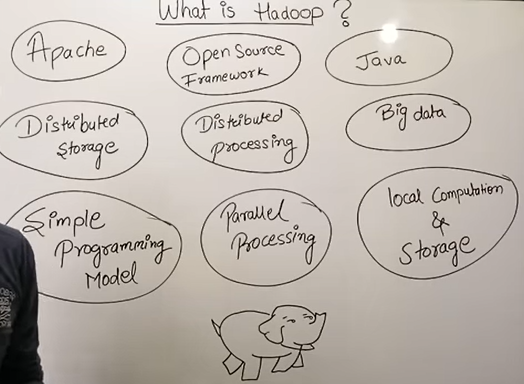
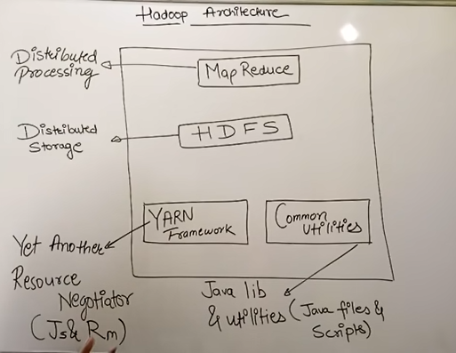
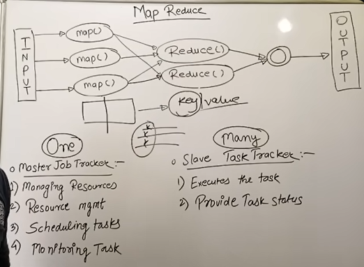

# HADOOP

History  
By Doug Cutting and Mike Cafarella in 2005.  

It was inspired by Google’s publications on:  
Google File System (GFS), MapReduce Programming Model

These papers showed how Google handled massive web-scale data.
Doug Cutting implemented the concepts in an open-source project called **Nutch**, which later grew into Hadoop under Apache Software Foundation.

Key Milestones
- 2005: Development started
- 2006: Became a Lucene subproject
- 2008: Became an Apache top-level project
- 2011–Present: Hadoop ecosystem evolved (YARN, Spark, HBase, Hive, etc.)

Today Hadoop is the backbone of big data processing across industries.

'

# Hadoop Distributed File System (HDFS)
HDFS is the storage layer of Hadoop designed to store large datasets reliably across clusters of commodity machines.

Key Features
- Highly fault-tolerant
- Stores huge files (TB–PB scale)
- Optimized for large sequential reads
- Write-once, read-many model
- Designed for clusters of inexpensive hardware

HDFS Architecture Components

1. NameNode  
Master node, Maintains file system metadata, 
Manages block locations, Does NOT store actual data

2. DataNode  
Worker nodes, Store actual data blocks, Serve read/write requests

3. Secondary NameNode  
Not a backup, Performs periodic checkpoints, Helps NameNode recovery

4. Block Storage
Default block size: 128 MB, Each block is replicated (default 3 copies)