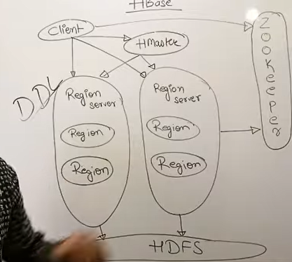

# NoSQL
Class of non-relational databases designed to handle:  
Massive volumes of data, High velocity (real-time data), Unstructured / semi-structured formats, Distributed storage, Horizontal scalability

---
#### Why NoSQL?
RDBMS has limitations with Big Data:  
rigid schema, joins are expensive, limited scaling.

NoSQL overcomes these by:  
Flexible schemas, Scale-out architecture, High performance, Support for distributed processing, Handling wide variety of data types

---
#### Types of NoSQL Databases
Key–Value, Document, Column-Oriented, Graph

---
# Sorted Ordered Column-Oriented Stores

Column stores store data column-wise instead of row-wise.

---
## Key/Value Stores
Examples: Redis, Memcached, Amazon DynamoDB

---
## Document Databases
Document databases store data in semi-structured JSON-like documents.
examples : MongoDB, CouchDB

---
## Graph Databases
Examples
Neo4j, Amazon Neptune

---

# Interfacing and Interacting with NoSQL

Interaction occurs through:

- Command-line shells (Mongo shell, Redis CLI)
- Drivers for languages (Python, Java, Node.js)
- REST APIs
- GUI tools (Compass for MongoDB, RedisInsight)

Operations include:

- Insert
- Update
- Delete
- Scan
- Query
- Bulk operations

---
# Storing & Accessing Data
General NoSQL Operations
- PUT / INSERT – add new documents/objects
- GET / FIND – fetch data
- UPDATE – modify fields
- DELETE – remove entries
- SCAN – retrieve sequential keys
- INDEX – improve query performance

---

Write : Data → MemStore → HLog → HDFS (flush when full)  

Read : Check BlockCache → MemStore → HFiles

---

| SQL Feature | MongoDB Equivalent |
| ----------- | ------------------ |
| Database    | Database           |
| Table       | Collection         |
| Row         | Document           |
| Column      | Field              |
| WHERE       | find() filter      |
| AND/OR      | $and / $or         |
| ORDER BY    | sort()             |
| LIMIT       | limit()            |
| JOIN        | $lookup            |
| GROUP BY    | aggregate($group)  |
