Similarity  
Numerical measure of how alike two data objects are  
Value is higher when objects are more alike  
Often falls in the range [0,1]

Dissimilarity (e.g., distance)  
Numerical measure of how different two data objects are  
Lower when objects are more alike  
Minimum dissimilarity is often 0  
Upper limit varies

Proximity refers to a similarity or dissimilarity

---

### DATA MATRIX
Normal matrix  
Rows = objects, Columns = attributes

### DISSIMILARITY MATRIX
Square matrix  
Entry (i, j) = distance/similarity between objects i & j  
hence diagonal remains 0  

> **Similarity( i, j ) = 1 - dist( i, j )**

---

## 
 PROXIMITY ATTRIBUTES

#### 1. NOMINAL 
If disimilarity = 1 => Completely different  
and if 0 => completely same  
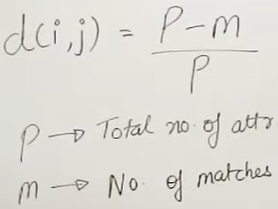
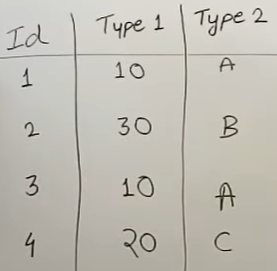
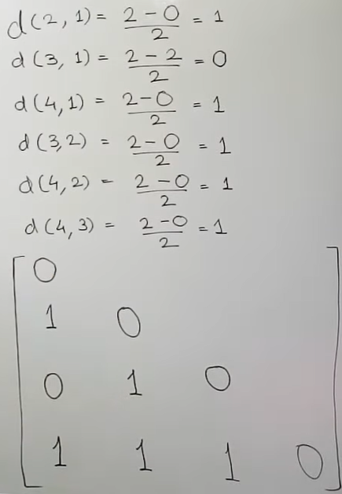

---

#### 2. BINARY ATTRIBUTES
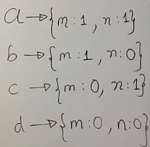

iF 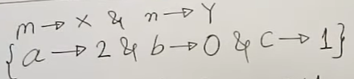  
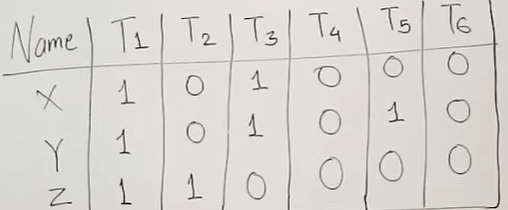
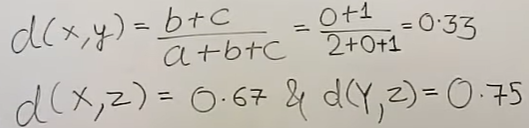

---
Asymmetric : 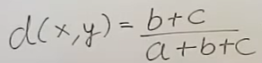

Symmetrix : 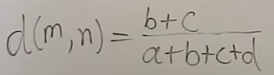

---

#### 3. NUMRICAL ATTRIBUTES

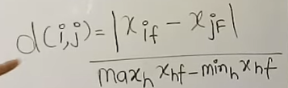  
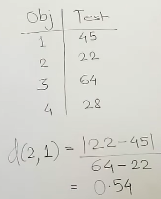

---
#### 4. ORDINAL ATTRIBUTE

Convert ranks to [0, 1] scale.

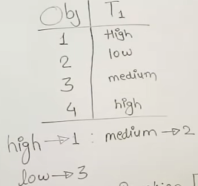  
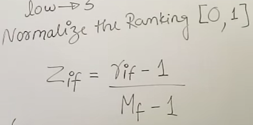

Total states : 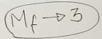

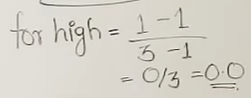

Similarly every 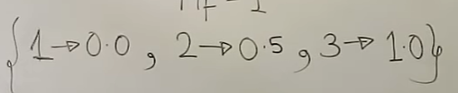