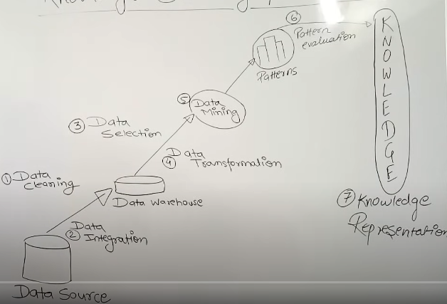

### Data Quality: Why Preprocess the Data?

MEASURES OF DATA QUALITY :-
Accuracy, Completeness, Consistency, Timeliness, Authenticity, Interpretability

MAJOR TASKS IN DATA PRE PROCESSING :-
1. Data Cleaning : Missing values, removing inconsistencies, outliers
2. Data Integration
3. Data Reduction : Dimensionality, Numerosity, Data compression
4. Data Transformation & Descretization : Normalization, Hierarchy generation

