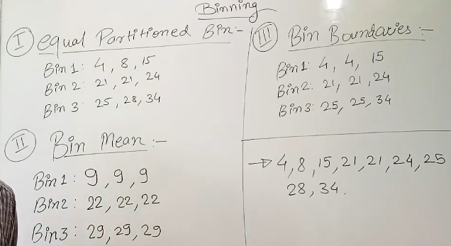

## 
 DATA CLEANING
### 1. Missing Values  
  1. Ignore the complete record
  2. Filling Manually
  3. Using gloabal constants NULL or N/A
  4. Use mean/median
### 2. Noisy Data
Noisy data is meaningless, incorrect, or missing data that can interfere with data analysis and model training

Common methods for data cleaning include:
1. **BINNING**  : Smoothing data by sorting values into "bins" and replacing them with the mean, median, or boundary values of that bin.
2. **Regression**:  
Using regression functions to smooth data and identify outliers.
3. **Outlier analysis**:  
Detecting and handling outliers using statistical methods or visualization techniques.
4. **Clustering**: 
Grouping similar data points and identifying outliers as points that fall outside the clusters. 