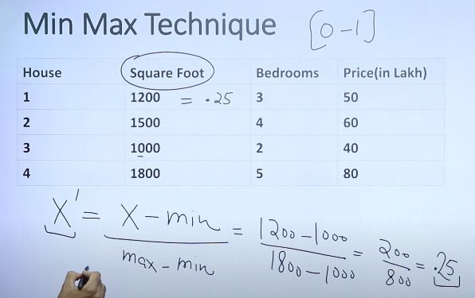
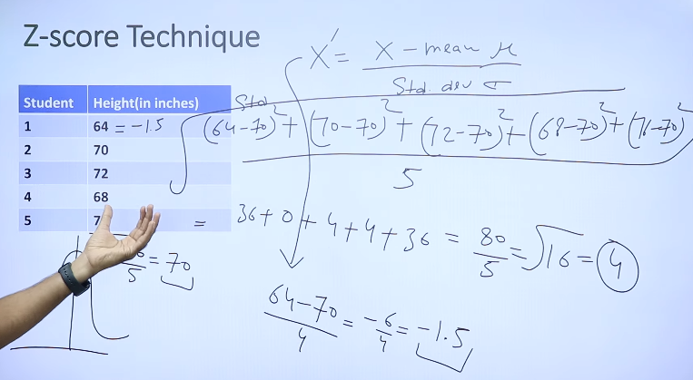

# NORMALIZATION ?
Used to scale and standardize the features of a dataset.  
Primary goal is to bring all features to a similar scale, typically 0 & 1

1. Min Max Normalization

2. Z Score Normalization
