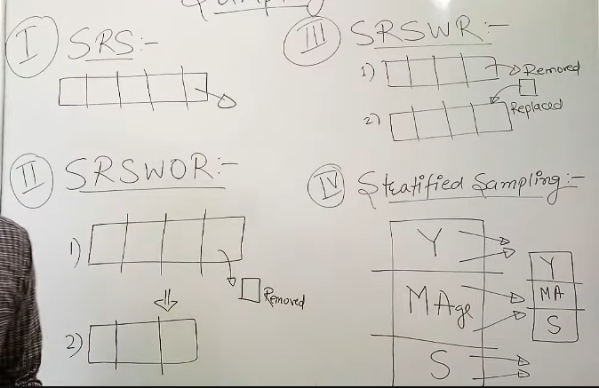

# DATA REDUCTION

A technique used to reduce the size of a dataset, while preserving the most important information.  
Beneficial in situations where the dataset is too large,  
or where dataset contains large amount of irrelevant/redundant information.

#### 1. Dimension Reduction
Reducing the number of features either by removing or  
by combining multiple features into a single feature.
1. SWFS : Step wise forward selection
2. SWBS : Step wise backward elimination

#### 2. Data Compression
1. Loseless : If reversed & we get original data when decompressed
2. Lossy 

#### 3. Numerosity Reduction
1. Parametic : Lil model
2. Non Parametic

#### 4. Discretization

This technique involves converting continuous data into discrete data by partitioning the range of possible values into intervals or bins.
1. Top down : Splitting

2. Bottom up : Merging

## 
 SAMPLING
1. SRS : Simple random sample
2. SRSWOR : Simple random sample without replacing
3. SRSWOR : Simple random sample with replacing
4. Stratified sampling
   
