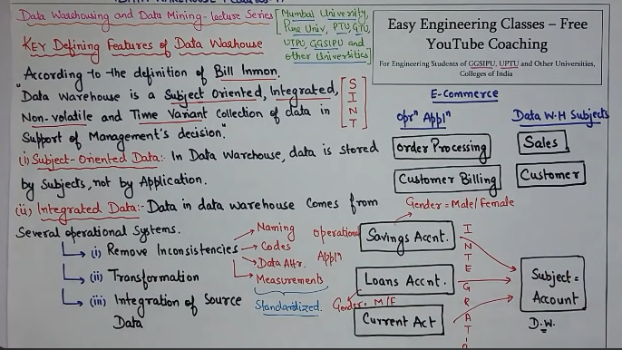

## DATAWAREHOUSE ?

Before Data Warehouses existed, organizations used Decision Support Systems (DSS) that directly accessed operational databases (like OLTP systems).
| Problem (in DSS)       | Solution (by DW)                            |
| ---------------------- | ------------------------------------------- |
| Scattered data         | Integrated single source (ETL process)      |
| Only current data      | Stores historical data                      |
| Inconsistent formats   | Data cleaning & standardization             |
| Slow OLTP queries      | Separate analytical system (OLAP)           |
| Poor data quality      | Data transformation before loading          |
| Departmental isolation | Enterprise-wide data access                 |
| Weak analytics         | Supports complex queries, BI, visualization |

---

#### 
DESIGN ISSUE
| Design Issue     | Description                   |
| ---------------- | ----------------------------- |
| Data Integration | Combine heterogeneous sources |
| Data Redundancy  | Avoid unnecessary duplicates  |
| Data Granularity | Level of detail stored        |
| Data History     | Duration of historical data   |
| Metadata         | Data about data               |
| Performance      | Query optimization            |
| Data Refresh     | Update frequency              |
| Security         | Access control policies       |
| Hardware         | Storage & scalability         |
| Schema Design    | Star / Snowflake choice       |

