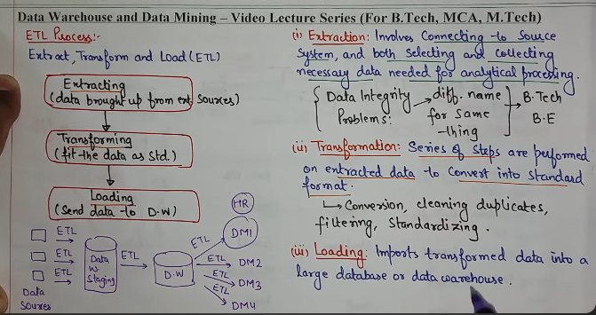

# ETL

ETL (Extract, Transform, Load) is a key process in data warehousing that prepares data for analysis. 

It involves:
- Extracting data from multiple sources
- Transforming it into a consistent format
- Loading it into a central data warehouse or data lake

ETL helps businesses unify and clean data, making it reliable and ready for analysis. 

It improves data quality, security, and accessibility, enabling better insights and faster decision-making in a world of diverse data sources.

---
### 1. Extraction
First step,  
Raw data is collected from various data sources.    
Goal is to gather data without altering its format.

Types of data sources can include:  
Structured: SQL databases   
Semi-structured: JSON, XML  
Unstructured: Emails, web pages

---
### 2. Transformation
Data is cleaned, aggregated, and formatted  
according to business rules. 

Common transformations include:

- Filtering: Removing irrelevant or incorrect data.
- Sorting: Organizing data into a required order
- Data Aggregating: Summarizing data to provide meaningful insights (e.g., averaging sales data).

---
### 3. Loading
Transferring the transformed data into a data warehouse, another system for storage. 
- **Full Load**: All data is loaded, often used during the initial population.
- **Incremental Load**: Only new or updated data is loaded

--- 
#### Some of the widely used ETL tools include:

- **Apache Nifi**: Open-source tool, real-time, automation across systems.
- **Talend**: Open-source, provides a graphical interface, support batch & real-time data processing, large-scale integration.
- **Hevo**: Modern data pipeline platform automating ETL and real-time data replication for cloud data warehouses.
- **Oracle Warehouse Builder**: Commercial ETL tool for managing large-scale data warehouses with transformation, cleansing, and integration features
- **Informatica PowerCenter**: An enterprise-level, proprietary ETL tool known for its robust features and scalability.
- **Microsoft SQL Server Integration Services (SSIS)**: used for a wide range of data integration tasks.
- A**mazon Web Services (AWS) Glue**: A fully managed ETL service that makes it easy to prepare and load data for analytics.