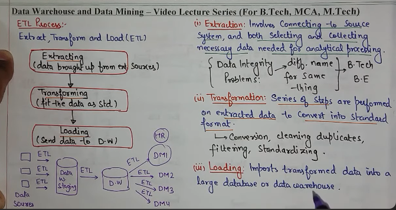

# ETL

ETL (Extract, Transform, Load) is a key process in data warehousing that prepares data for analysis. 

It involves:
- Extracting data from multiple sources
- Transforming it into a consistent format
- Loading it into a central data warehouse or data lake

ETL helps businesses unify and clean data, making it reliable and ready for analysis. 

It improves data quality, security, and accessibility, enabling better insights and faster decision-making in a world of diverse data sources.

#### 1. Extraction
The Extract phase is the first step in the ETL process, where raw data is collected from various data sources. These sources can be diverse, ranging from structured sources like databases (SQL, NoSQL), to semi-structured data like JSON, XML, or unstructured data such as emails or flat files. The main goal of extraction is to gather data without altering its format, enabling it to be further processed in the next stage.

Types of data sources can include:

Structured: SQL databases, ERPs, CRMs
Semi-structured: JSON, XML
Unstructured: Emails, web pages, flat files

#### 2. Transformation
During transformation, the data is cleaned, aggregated, and formatted according to business rules. 

Common transformations include:

- Data Filtering: Removing irrelevant or incorrect data.
- Data Sorting: Organizing data into a required order for easier analysis.
- Data Aggregating: Summarizing data to provide meaningful insights (e.g., averaging sales data).

#### 3. Loading
This phase involves transferring the transformed data into a data warehouse, data lake, or another target system for storage. 
- Full Load: All data is loaded into the target system, often used during the initial population of the warehouse.
- Incremental Load: Only new or updated data is loaded, making this method more efficient for ongoing data updates.

#### Some of the widely used ETL tools include:

- **Apache Nifi**: Open-source tool for real-time data flow management and automation across systems.
- **Talend**: Open-source ETL tool supporting batch and real-time data processing for large-scale integration.
- **Microsoft SSIS**: Commercial ETL tool integrated with SQL Server, known for performance and scalability in data integration.
- **Hevo**: Modern data pipeline platform automating ETL and real-time data replication for cloud data warehouses.
- **Oracle Warehouse Builder**: Commercial ETL tool for managing large-scale data warehouses with transformation, cleansing, and integration features