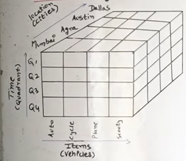
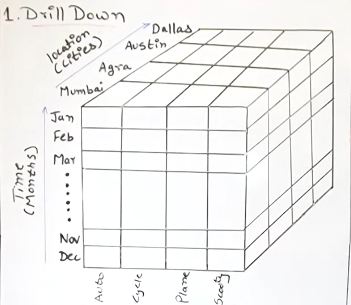
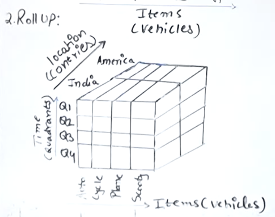
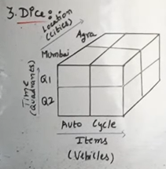
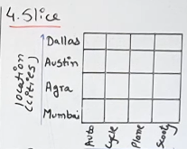
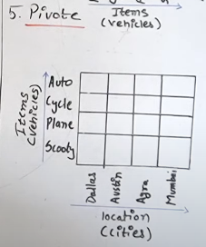

## OLAP ?
- Online Analytical Processing Server
- S/w technology that allows users, to analyze information from multiple database systems at the same time
- Based on multidimensional data model
- OLAP databases are divided into one or more cubes and these cubes are known as Hyper-cubes.

---
### OLAP OPERATIONS ?

1. **DRILL DOWN** : 
Less detailed into highly detailed data  
It can be done by:
    - Moving down in the concept hierarchy
    - Adding a new dimension
  
    

2. **ROLL UP**

3. **DICE**  
Selecting a sub cube.

4. **SLICE**  
It selects a single dimension, which results in a new sub-cube creation
 Q1

5. **PIVOT**  
Also known as rotation operation as it rotates the current view to get a new view
