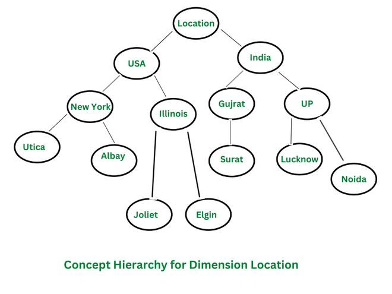

#### Concept Hierarchy
In data mining, the concept of a concept hierarchy refers to the organization of data into a tree-like structure, where each level of the hierarchy represents a concept that is more general than the level below it. This hierarchical organization of data allows for more efficient and effective data analysis, as well as the ability to drill down to more specific levels of detail when needed. The concept of hierarchy is used to organize and classify data in a way that makes it more understandable and easier to analyze. The main idea behind the concept of hierarchy is that the same data can have different levels of granularity or levels of detail and that by organizing the data in a hierarchical fashion, it is easier to understand and perform analysis.  

#### Types of Concept Hierarchies
1. Schema Hierarchy:  Schema Hierarchy is a type of concept hierarchy that is used to organize the schema of a database in a logical and meaningful way, grouping similar objects together. A schema hierarchy can be used to organize different types of data, such as tables, attributes, and relationships, in a logical and meaningful way. This can be useful in data warehousing, where data from multiple sources needs to be integrated into a single database.   
2. Set-Grouping Hierarchy: Set-Grouping Hierarchy is a type of concept hierarchy that is based on set theory, where each set in the hierarchy is defined in terms of its membership in other sets. Set-grouping hierarchy can be used for data cleaning, data pre-processing and data integration. This type of hierarchy can be used to identify and remove outliers, noise, or inconsistencies from the data and to integrate data from multiple sources.  
3. Operation-Derived Hierarchy: An Operation-Derived Hierarchy is a type of concept hierarchy that is used to organize data by applying a series of operations or transformations to the data. The operations are applied in a top-down fashion, with each level of the hierarchy representing a more general or abstract view of the data than the level below it. This type of hierarchy is typically used in data mining tasks such as clustering and dimensionality reduction. The operations applied can be mathematical or statistical operations such as aggregation, normalization 
4. Rule-based Hierarchy: Rule-based Hierarchy is a type of concept hierarchy that is used to organize data by applying a set of rules or conditions to the data. This type of hierarchy is useful in data mining tasks such as classification, decision-making, and data exploration. It allows to the assignment of a class label or decision to each data point based on its characteristics and identifies patterns and relationships between different attributes of the data