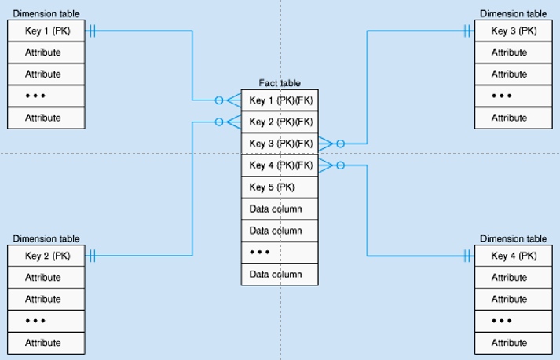
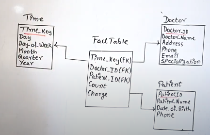

# SCHEMA
Just like in RDBMS we store data in tables,  
similarly here in data warehouse we store data as star/snowflake schema

2 major componenets - 
1. Fact Table : Center
2. Dimension Table

### STAR SCHEMA
A central fact table is connected to dimension tables,  
design is simpler and faster for querying

