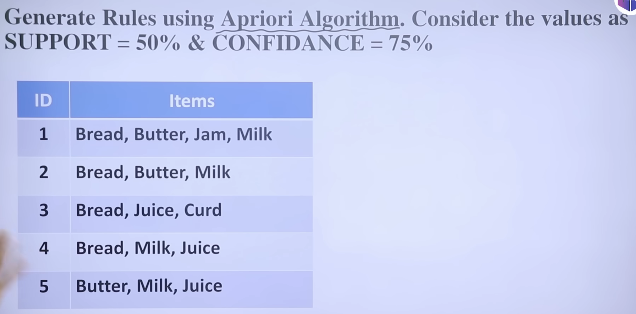
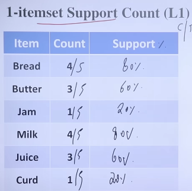
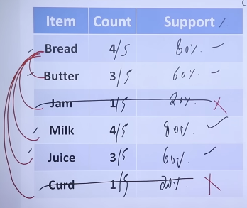

# Apriori Algorithm
Frequent Pattern Mining Method  
To efficiently find frequent itemsets level-wise.

```
Step 1: Find all frequent 1-itemsets  
Check support of individual items.

Step 2: Generate 2-itemset candidates  
Combine frequent 1-itemsets.

Step 3: Prune  
Remove itemsets that have any subset not frequent.

Step 4: Count support
Calculate support for the candidates.

Step 5: Keep those ≥ min support
Repeat for 3-itemsets, 4-itemsets… until no more itemsets can be formed.
```






**Weakness of Apriori ?**  
Many scans of the database  
Too many candidate sets