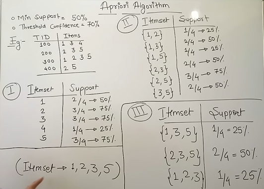
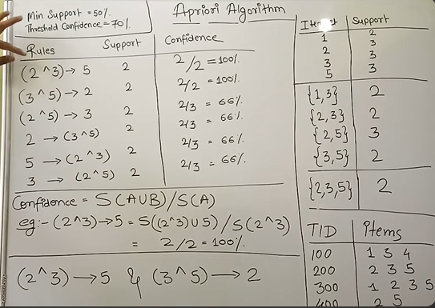

# Apriori Algorithm
Frequent Pattern Mining Method  
To efficiently find frequent itemsets level-wise.

> If an itemset is frequent, all of its subsets must also be frequent.


```
1. Find individual dataset, and calculate their support
2. Remove with < min support
3. Make pairs of items left, anc calculate support
4. Same above steps untill i itemset left
```



```
5. Make combination as (a^b)->c
6. Calculate confidence and remove if less than threshold
7. You are left with association rules.
```
