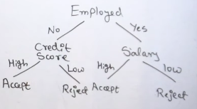

# Decision Tree?
Can be used both in regression + classification.  
> Labelled data -> algorithms -> classifier model

A tree-like structure classifier where:

- Decision Node (Root+Internal Nodes) -> Tests & Splits
- Braches -> Decisions taken above
- Leaf node → class label

