# 
 NORMALIZATION

Normalisation is a step towards DB optimisation.

**FUNCTIONAL DEPENDANCY ?**  
It's a relationship between the primary key column(usually) to the other column of the table.

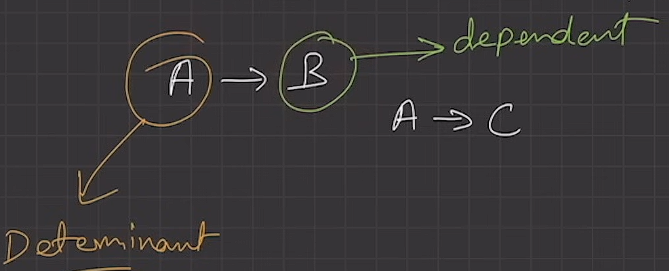

---
**FD TYPES :-**  
1. **Trivial FD**   
A → B has trivial functional dependency  
if B is a subset of A.
    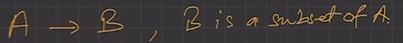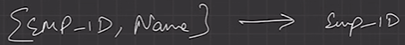
Also A->A, B->B are also Trivial FD.
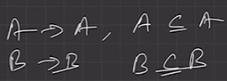

1. **Non-trivial FD**  
A → B has a non-trivial functional dependency  
if B is not a subset of A.

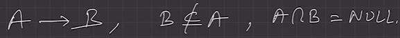

---
**FD RULES :-**  
1. REFLEXIVE:  
If ‘A’ is a set of attributes and ‘B’ is a subset of ‘A’. Then, A→ B
2. AUGEMENTATION:  
If A→ B holds, then AX→ BX holds too.
3. TRANSITIVITY:  
If A→ B and B→ C then A→ C.

---
## 
 WHY NORMALIZATION?
To avoid redundancy in the DB,  
Redudndant data introduces 3 types of anomalies(abnormalities):-

1. **INSERTION ANAMOLY**  
When certain data (attribute) can not be inserted into the DB without the presence of other data.
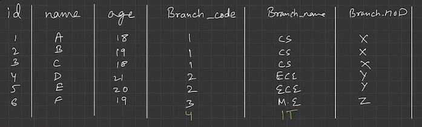  
Here we can't add student if no brach assigned, cant add a brach if we have no student of that branch => Both should exist independently.  
2. **DELETION**   
Situation where the deletion of data results in the unintended loss of some other important data.
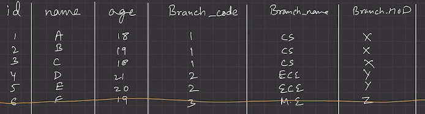
Here brach will be vanished if we remove this row
3. **UPDATION**  
when an update of a single data value requires multiple rows of data to be updated.  
If hod get's change we have to change in mulitple areas, Data inconsistency arises too.

---
Due to these anomalies, DB size increases and DB performance become very slow.  
To rectify these anomalies and the effect of these of DB, we use Database optimisation technique called NORMALISATION.

### NORMALIZATION ?
- Normalisation is used to minimise the redundancy from a relations.  
- It is also used to eliminate Insertion, Update, and Deletion Anomalies.
- Normalisation divides the composite attributes into individual attributes links them using relationships.
 

---
### 1NF
- Every cell must have atomic value.
- Table must not have multi-valued attributes.
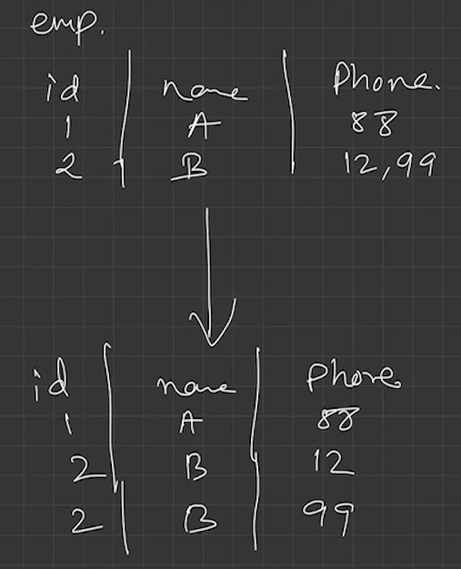  
Theroetically else gonna ruin space

---
### 2NF
Relation must be in 1NF.  
- There should not be any partial dependency.
  - All non-prime attributes must be fully dependent on PK.
  - Non prime attribute can not depend on the part of the PK.
  - 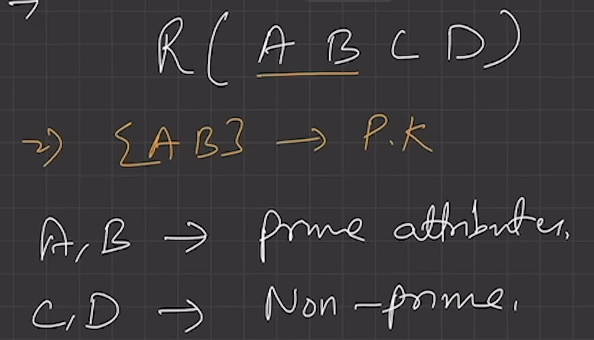  

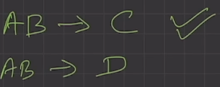  
Issue
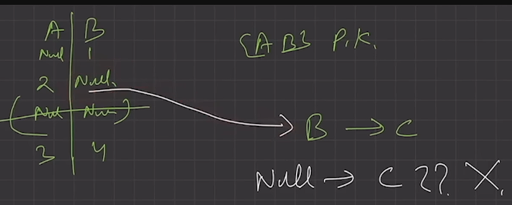  
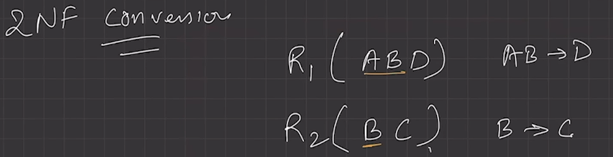

---
### 3NF
- Relation must be in 2NF.  
- No transitivity dependency exists.
- Non-prime attribute should not find a non-prime attribute.
- 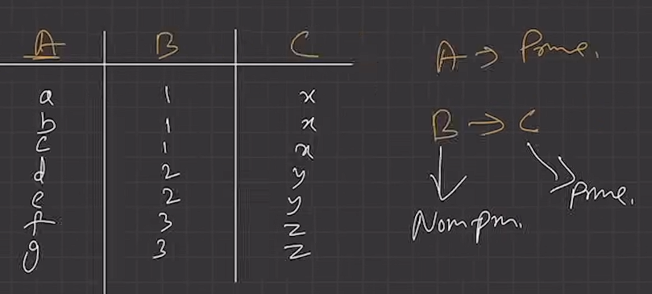

---
# BCNF
- Relation must be in 3NF.
- FD: A -> B, A must be a super key.
  - We must not derive prime attribute from any prime or non-prime attribute.
- 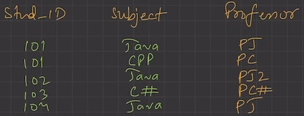