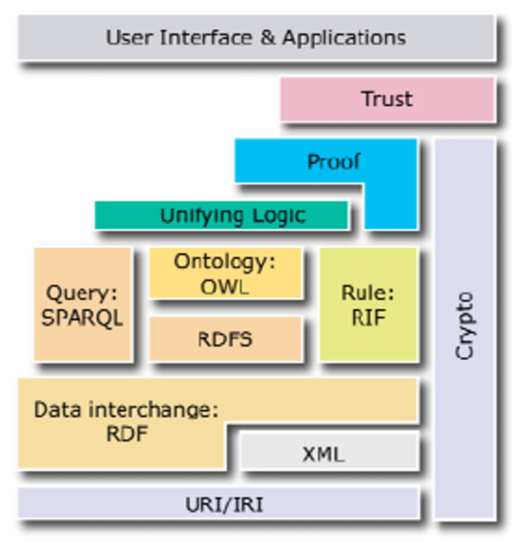

# Semantic Web: Fundamental Concepts and Issues

## 1. Introduction
The Semantic Web is an extension of the existing web in which information is given well-defined meaning, allowing machines to understand, interpret, and process data intelligently. It was proposed by Sir Tim Berners-Lee to transform the web from a document-centric web to a data-centric web.

Vision: A web of linked data that is interpretable by machines, enabling automation, reasoning, and intelligent services.

Roadmap:
- Web 1.0 – Static, read-only content.
- Web 2.0 – Dynamic, interactive, social web.
- Web 3.0 / Semantic Web – Intelligent, decentralized, data-linked web.

## 2. Fundamental Concepts of Semantic Web

### 2.1 Semantics
Semantics refers to the meaning of data.  
In the Semantic Web, data is structured in such a way that machines can understand the meaning and relationships between information rather than only displaying it to humans.

### 2.2 Metadata
Metadata is data about data.  
It describes properties such as author, type, and relationships.  
Metadata helps machines interpret content correctly.

### 2.3 Resource
A resource is any identifiable object on the web such as a web page, document, image, person, or place.

### 2.4 URI (Uniform Resource Identifier)
URI uniquely identifies a resource on the web.  
It removes ambiguity and allows precise identification of data.

### 2.5 RDF (Resource Description Framework)
RDF is the basic data model of the Semantic Web.  
It represents information using triples: Subject, Predicate, and Object.  
RDF enables linking and sharing of data.

### 2.6 Ontology
Ontology is a formal representation of knowledge in a specific domain.  
It defines classes, properties, relationships, and constraints, providing a shared vocabulary.

### 2.7 RDF Schema (RDFS)
RDFS extends RDF by defining class hierarchies and property hierarchies, allowing basic reasoning.

### 2.8 OWL (Web Ontology Language)
OWL is a more expressive language than RDFS.  
It supports complex relationships, constraints, and logical reasoning.

### 2.9 SPARQL
SPARQL is the query language used to retrieve and manipulate RDF data.  
It is similar to SQL but works on RDF graphs.

### 2.10 Reasoning and Inference
Reasoning allows machines to infer new knowledge from existing data using logical rules.

## 3. Issues and Challenges in Semantic Web

### 3.1 Complexity of Ontology Design
Designing accurate ontologies is complex and requires both domain expertise and technical knowledge.

### 3.2 Scalability
Handling and reasoning over large volumes of semantic data is computationally expensive.

### 3.3 Performance
Querying RDF data using SPARQL can be slower compared to traditional databases.

### 3.4 Data Quality and Consistency
Incorrect or inconsistent metadata leads to unreliable results.

### 3.5 Interoperability
Different ontologies may represent the same concept differently, making integration difficult.

### 3.6 Security and Privacy
Linking large datasets can expose sensitive information, raising privacy concerns.

### 3.7 Trust and Provenance
It is difficult to verify the source, authenticity, and reliability of semantic data.

## 4. Conclusion
The Semantic Web enables machines to understand and reason over web data using technologies like RDF, Ontologies, OWL, and SPARQL. Despite challenges such as scalability, complexity, and privacy, it forms the foundation for intelligent web applications.

# Semantic Web Architecture (Layered Cake) and Technologies

## 1. Introduction
The Semantic Web Architecture, also known as the Layered Cake or Semantic Web Stack, represents a layered framework of technologies that enable machines to understand, interpret, and reason over web data. It was proposed by Sir Tim Berners-Lee to build an intelligent and meaningful web.

## 2. Semantic Web Layered Architecture (Layered Cake)

### 2.1 URI and Unicode Layer
- Unicode provides a standard character encoding.
- URI (Uniform Resource Identifier) uniquely identifies resources on the web.
- Forms the foundation of the Semantic Web.

### 2.2 XML Layer
- XML provides a structured format for data representation.
- XML Schema defines structure and data types.
- Does not provide semantic meaning but enables data exchange.

### 2.3 RDF Layer
- RDF (Resource Description Framework) is the core data model.
- Represents data in Subject–Predicate–Object triples.
- Enables linking of data across different sources.

### 2.4 RDF Schema (RDFS) Layer
- Extends RDF by defining classes and properties.
- Supports class hierarchies and property hierarchies.
- Provides basic semantic reasoning.

### 2.5 OWL (Web Ontology Language) Layer
- Provides rich vocabulary for defining ontologies.
- Supports complex relationships, constraints, and logic.
- Enables advanced reasoning capabilities.

### 2.6 SPARQL Layer
- Query language for retrieving and manipulating RDF data.
- Used to query RDF graphs stored in triple stores.

### 2.7 Logic Layer
- Applies logical rules to infer new knowledge.
- Enables automated reasoning over semantic data.

### 2.8 Proof Layer
- Verifies correctness of inferred knowledge.
- Provides explanation of how conclusions are derived.

### 2.9 Trust Layer
- Ensures data reliability and authenticity.
- Handles security, digital signatures, and trust policies.

