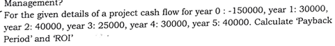
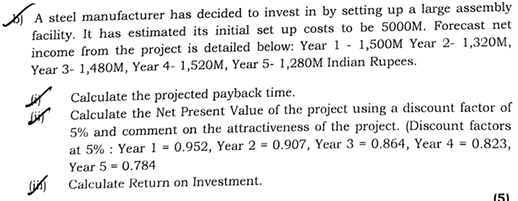

| **Method**                     | **What it Considers**              | **Focus**                            |
| ------------------------------ | ---------------------------------- | ------------------------------------ |
| **Net Profit**                 | Simple profit after costs          | Ignores time value of money          |
| **Return on Investment (ROI)** | % return based on total investment | Doesn’t consider timing of returns   |
| **Discounted Cash Flow (DCF)** | Time value of money + future cash  | Most accurate for long-term projects |

---

• Year 0: $-150000$ 
• Year 1: $-150000 + 30000 = -120000$ 
• Year 2: $-120000 + 40000 = -80000$ 
• Year 3: $-80000 + 25000 = -55000$ 
• Year 4: $-55000 + 30000 = -25000$ 
• Year 5: $-25000 + 40000 = 15000$ 

The payback period is the time it takes for the cumulative cash flow to become positive. The cumulative cash flow becomes positive sometime in year 5.  

To find the exact time, we use the following formula: 

$\text{Payback Period} = \text{Year before full recovery} + \frac{\text{Unrecovered amount at start of the year}}{\text{Cash flow during the year}}$ 

$\text{Payback Period} = 4 + \frac{25000}{40000} = 4 + 0.625 = 4.625 \text{ years}$ 

Step 2: Calculate the Return on Investment (ROI) 
The formula for ROI is: 
$\text{ROI} = \frac{\text{Total return on investment} - \text{Initial investment}}{\text{Initial investment}} \times 100$ 
First, calculate the total return on investment by summing all the positive cash flows. 
$\text{Total return} = 30000 + 40000 + 25000 + 30000 + 40000 = 165000$ 
Now, substitute the values into the ROI formula. 
$\text{ROI} = \frac{165000 - 150000}{150000} \times 100$ 
$\text{ROI} = \frac{15000}{150000} \times 100 = 0.1 \times 100 = 10\%$ 
Answer: 
The payback period is 4.625 years and the ROI is 10%. 

----

b) 
• Year 1: 1500M 
• Year 2: $1500M + 1320M = 2820M$ 
• Year 3: $2820M + 1480M = 4300M$ 
• Year 4: $4300M + 1520M = 5820M$ 

The payback period falls in Year 4, as the cumulative net income exceeds the initial investment of 5000M in this year. 

$\text{Payback Period} = (\text{Last year with negative cumulative cash flow}) + \frac{|\text{Cumulative cash flow at the end of the last year with negative cumulative cash flow}|}{\text{Cash flow in the next year}}$ 

In our case, the last year with a negative cumulative cash flow (or rather, a cumulative cash flow that has not yet covered the initial investment) is Year 3. 

$\text{Amount to be recovered} = 5000M - 4300M = 700M$ 
The income in the next year (Year 4) is 1520M. 

$\text{Fraction of year needed} = \frac{700M}{1520M} \approx 0.46 \text{ years}$ 

$\text{Payback Period} = 3 \text{ years} + 0.46 \text{ years} = 3.46 \text{ years}$ 
Answer: 
The projected payback time is approximately 3.46 years. 

c ) Step 1: Calculate the Net Present Value (NPV) 
The Net Present Value (NPV) is calculated by discounting each year's net income by the given discount factor and then subtracting the initial investment. 
$\text{NPV} = (\text{Year 1 income} \times \text{Year 1 discount factor}) + (\text{Year 2 income} \times \text{Year 2 discount factor}) + (\text{Year 3 income} \times \text{Year 3 discount factor}) + (\text{Year 4 income} \times \text{Year 4 discount factor}) + (\text{Year 5 income} \times \text{Year 5 discount factor}) - \text{Initial Investment}$ 
$\text{NPV} = (1500 \times 0.952) + (1320 \times 0.907) + (1480 \times 0.864) + (1520 \times 0.823) + (1280 \times 0.784) - 5000$ 
$\text{NPV} = 1428 + 1197.24 + 1278.72 + 1250.96 + 1003.52 - 5000$ 
$\text{NPV} = 6158.44 - 5000$ 
$\text{NPV} = 1158.44$ 
Step 2: Comment on the attractiveness of the project 
A project is generally considered attractive if its Net Present Value (NPV) is positive, as this indicates that the project is expected to generate more value than the initial investment, after accounting for the time value of money. Since the calculated NPV is 1158.44M, which is a positive value, the project is considered attractive. 
Answer: 
The Net Present Value (NPV) of the project is 1158.44M Indian Rupees. The project is considered attractive because the NPV is positive. 
d) 
Step 1: Calculate the Return on Investment (ROI) 
The Return on Investment (ROI) is calculated by dividing the total net profit from the project by the initial investment. 
$\text{Total Net Profit} = (\text{Total Net Income}) - (\text{Initial Investment})$ 
$\text{Total Net Income} = 1500 + 1320 + 1480 + 1520 + 1280 = 7100M$ 
$\text{Total Net Profit} = 7100M - 5000M = 2100M$ 
$\text{ROI} = \frac{\text{Total Net Profit}}{\text{Initial Investment}} \times 100$ 
$\text{ROI} = \frac{2100M}{5000M} \times 100$ 
$\text{ROI} = 0.42 \times 100 = 42\%$ 
Answer: 
The Return on Investment (ROI) is 42%. 

AI responses may include mistakes.

