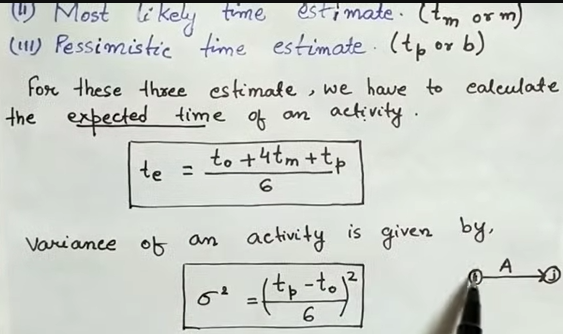

# UNIT 3 — Activity Planning & Scheduling

## 1. Activity Planning
Defines:
- Tasks  
- Dependencies  
- Schedules  
- Resource needs  

---

## 2. Network Planning Models
Two major models:
- **Activity-on-Arrow (AOA)**
- **Activity-on-Node (AON) / Precedence Network**

---

## 3. Activity-on-Arrow (AOA)
- Activities on arrows  
- Events on nodes  

---

## 4. Precedence Network (AON)
- Activities on nodes  
- Arrows show dependencies  
- Supports complex relationships  
- Most commonly used  

---

## 5. Forward Pass Calculation
Determines earliest timings.

- **ES = Max(EF of predecessors)**
- **EF = ES + Duration**

---

## 6. Backward Pass Calculation
Determines latest timings.

- **LF = Min(LS of successors)**
- **LS = LF – Duration**

---

## 7. Critical Path
- Activities have **zero slack**  
- Longest path in network  
- Determines minimum project time  

---

## 8. Slack / Float
Extra time an activity can be delayed.

`Slack = LS – ES = LF – EF`

---

